# 🌸 Encantos SPA - Sistema de Gestión Integral

Sistema completo de gestión para SPA con reservas, libro de reclamaciones, punto de venta, inventario y más.

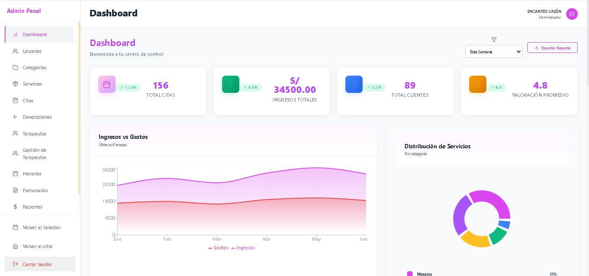

## 🏠 Vista Principal

Página principal del sistema con diseño moderno y responsive.


## 🚀 Características Principales

### 💼 Panel de Administración

Dashboard completo con estadísticas en tiempo real, gestión de citas, servicios y más.


### 📅 Sistema de Gestión de Citas

Administración completa de reservas con calendario, estados y seguimiento.

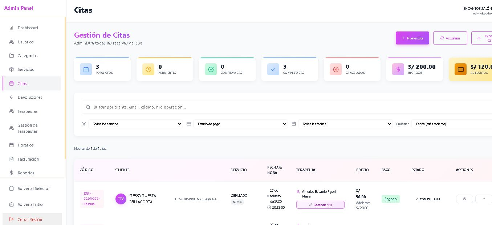

### 💆 Gestión de Servicios

Control de servicios del SPA con precios, duración y categorías.


### 👥 Gestión de Terapeutas

Sistema completo de terapeutas con horarios, comisiones y disponibilidad.

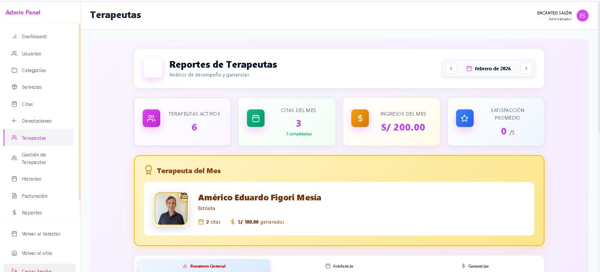


### 📋 Categorías de Servicios

Organización por categorías para mejor gestión.

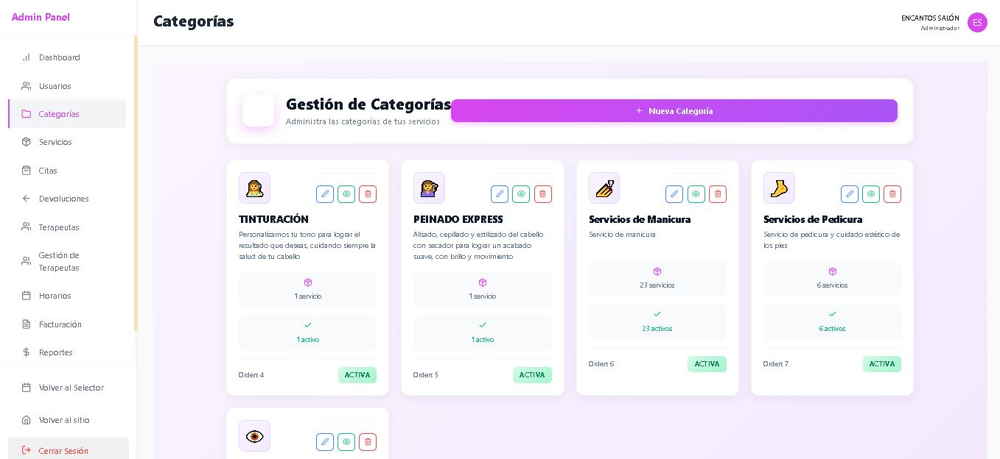

### 📕 Libro de Reclamaciones (INDECOPI)

Cumplimiento normativo con formulario completo conforme a ley peruana.

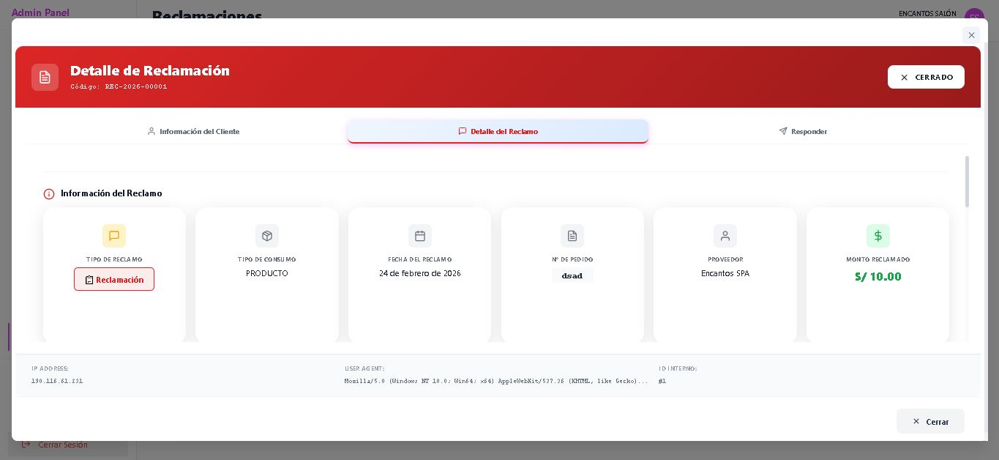

### 📅 Sistema de Reservas Online

**Paso 1:** Selección de servicio


**Paso 2:** Selección de día y hora


**Paso 3:** Confirmación y pago


### 📊 Reportes y Estadísticas

Análisis detallado de ventas, servicios más solicitados y rendimiento.

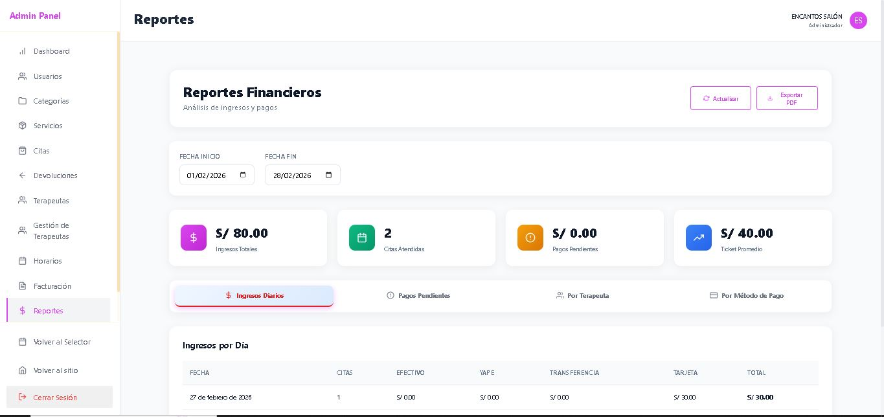

### 💰 Sistema de Facturación

Gestión de comprobantes electrónicos integrado con Nubefact.

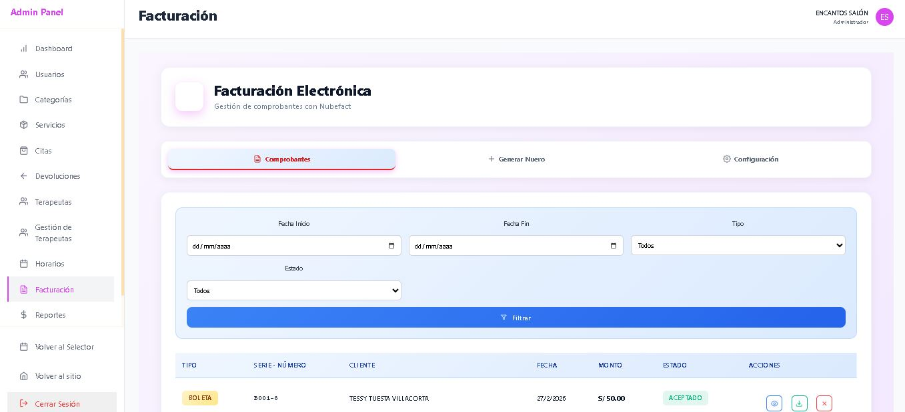

### 🔄 Gestión de Devoluciones

Control de devoluciones y reembolsos con trazabilidad completa.

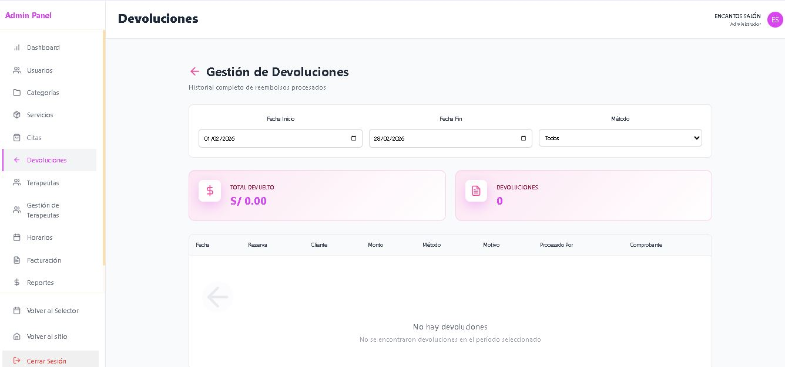

### 👤 Gestión de Usuarios

Administración de perfiles de usuario con roles y permisos.

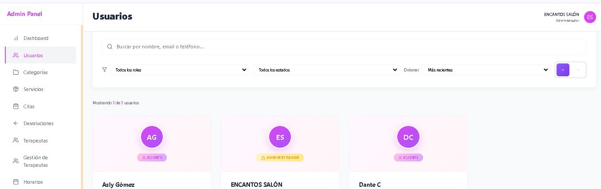

### ⏰ Horarios y Disponibilidad

Configuración de horarios de atención y disponibilidad de terapeutas.

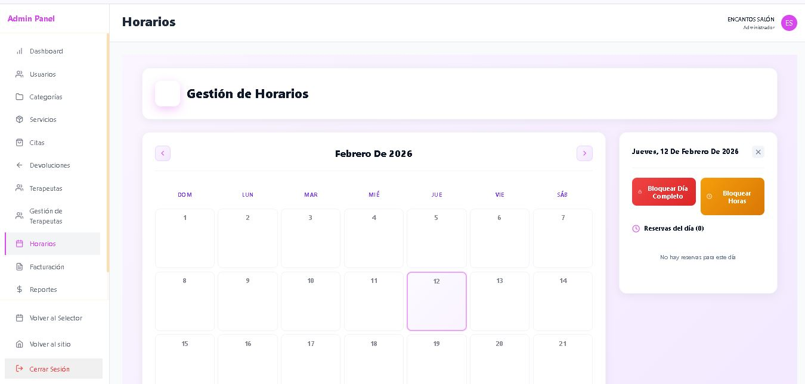

### 👤 Perfil de Usuario

Gestión de perfil personal con configuración de cuenta.

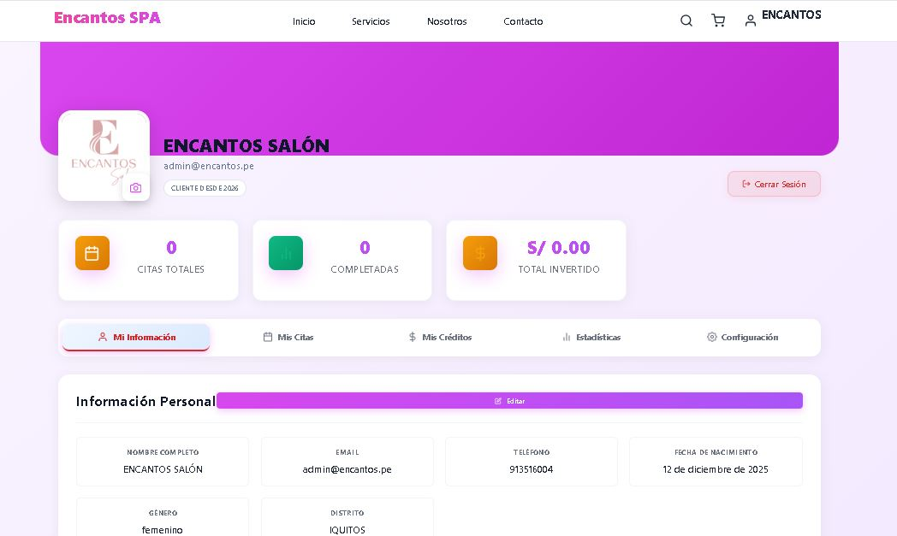

### ℹ️ Páginas Informativas

**Nosotros**


**Contacto**


## 🛠️ Tecnologías Utilizadas

### Frontend
- **React 18** - Framework principal
- **Vite** - Build tool y dev server
- **React Router DOM** - Sistema de navegación
- **SweetAlert2** - Alertas y notificaciones
- **Chart.js / Recharts** - Gráficos y estadísticas
- **React Icons** - Iconografía completa
- **CSS3** - Estilos personalizados

### Backend
- **PHP 8+** - Lenguaje servidor
- **MySQL 8** - Base de datos
- **PHPMailer** - Sistema de emails
- **JWT** - Autenticación segura
- **PDO** - Capa de abstracción de base de datos

### Integraciones
- **Izipay** - Pasarela de pago principal
- **PayPal** - Procesador internacional
- **Culqi** - Pagos Perú
- **Yape/Plin** - Billeteras móviles
- **Nubefact** - Facturación electrónica SUNAT

## 📦 Instalación

### Requisitos Previos
- Node.js 16+ y npm
- PHP 8.0+
- MySQL 8.0+
- Apache/Nginx
- Composer (opcional)

### Instalación Frontend
```bash